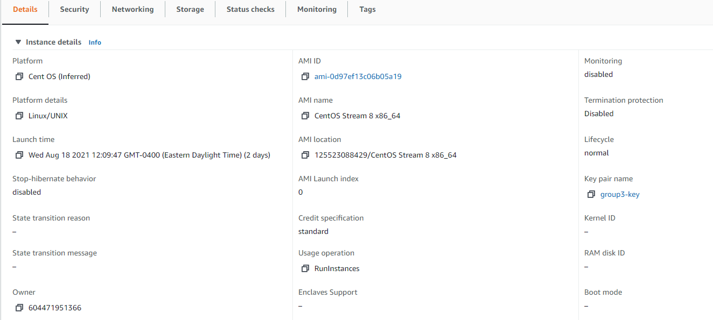
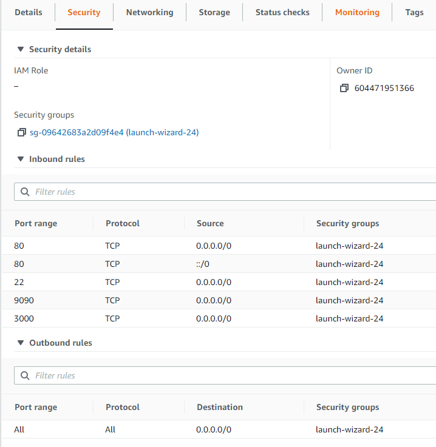

# MLH-Holiday Planner Web app

## https://holidayplanner.tech

## Usage

1. Download Docker and docker-compose and make sure they are running
2. Clone the repository
3. Make a local copy of `.env` file following `example.env`
4. Obtain a Skyscanner API key from: https://rapidapi.com/skyscanner/api/skyscanner-flight-search/ and add into the `.env`. file
5. Start development environment:

```
$ docker-compose up --build -d
```

Access the flask app at http://localhost:5000/

Any changes to HTML front-end and back-end will be reflected by hitting refresh in the browser.<br>
To install additional Flask packages, re-run docker-compose up build command.

## Monitoring

Below are the monitoring tools used for our application:

-   cAdvisor is available on http://localhost:8080
-   Prometheus is available on http://localhost:9090
-   Grfana is available on http://localhost:3000

## More about Holiday Planner

### Inspiration

While brainstorming project ideas, one of our team members mentioned how difficult it was to plan their vacation. This got us thinking about what can be improved in the process and noticed how tedious it was to organise a trip across multiple bookings. Our aim was to solve the problem of having to juggle between different websites, so we built a platform which combines all of the necessary features.

### What it does

Our app makes it easier for people to plan their holiday trips. With an easy to use flight search and soon to come hotel search, users can quickly find accommodations for wherever they plan a visit. It relieves the stress of planning vacations so you can avoid the hassle and spend more time enjoying your holiday.

### How we built it

For front-end, we used `Jinja` templating along with `Bootstrap` to make our page responsive. We built the back-end of our server using `Flask` with `postgreSQL` as our database. The app is deployed on `aws-ec2` instance on CentOS machine and is fully dockerised with a working CI/CD pipeline built with GitHub Actions. <br>
In addition, we implemented reverse-proxy using `nginx` direclty on our CentOS to provide a more stremalined dev environment on our local machines.<br>
The machine also runs dockerized `cAdvisor`, `Prometheus`, and `Grafana` for continuous monitoring.

## Challenges we ran into

There were some functionalities which we were unable to implement because of time constraints and being short-handed due to one of our team members falling sick. The flight scanner API provided only a basic dataset and limited our use cases, as a result, we had to scale back our app functionalities.
We thought of shifting to another feature to allow users to block the flight times in their Google Calendar, but getting the Calendar API to work was a challenge as it required OAuth2 implementations and we were short on time and people.
To fix this we implemented a simple feature, when the user clicks on the ‘book now’ button, our website redirects to the actual Skyscanner website where all the search parameters are passed in.

## Accomplishments that we're proud of

-   How we adjusted each challenge by communicating and working well with each other
-   From not knowing much about web development to being able to host a continuously deployed website is an amazing feeling

## What we learned

-   For front-end, we learned a lot about working with `Bootstrap` files for designing and `jQuery` files for the animations.
-   This project increased our working knowledge in Flask and its family of tools such as import, sessions, requests, SQLAlchemy, etc.
-   We learned how to integrate our apps with external APIs
-   We gained practical experience in implementing CI/CD pipeline for our project; working with `AWS-EC2`, `CentOS`, `GitHub Actions`, `Docker`, and various monitoring tools

## What's next for MLHolidays

-   Integrating a hotel and car rental api with the listings endpoint.
-   Adding a travel endpoint which uses web scraping to extract data from tripadvisor.com.
-   Provide more functionality for the user such as saving user reviews and queries

## Tech Stack

### Front-end

    HTML
    CSS
    Bootstrap

### Back-end

    Flask
    PostgreSQL
    Docker

### DevOps

    Nginx
    GitHub Actions
    cAdvisor
    Prometheus
    Grafana

## AWS Configurations

### AMI Image



### AWS Firewall Setting


